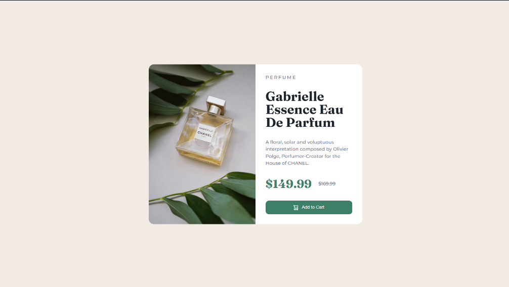
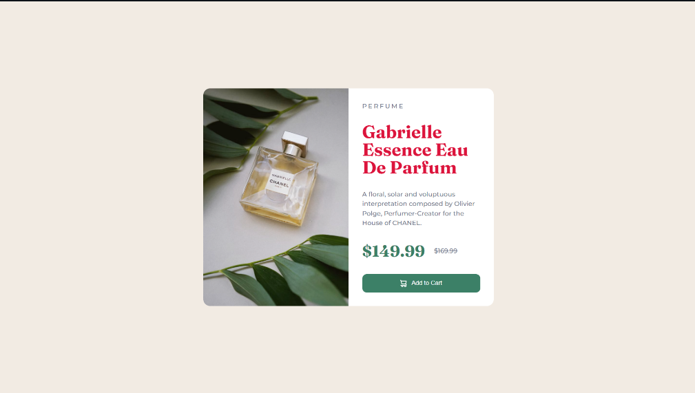
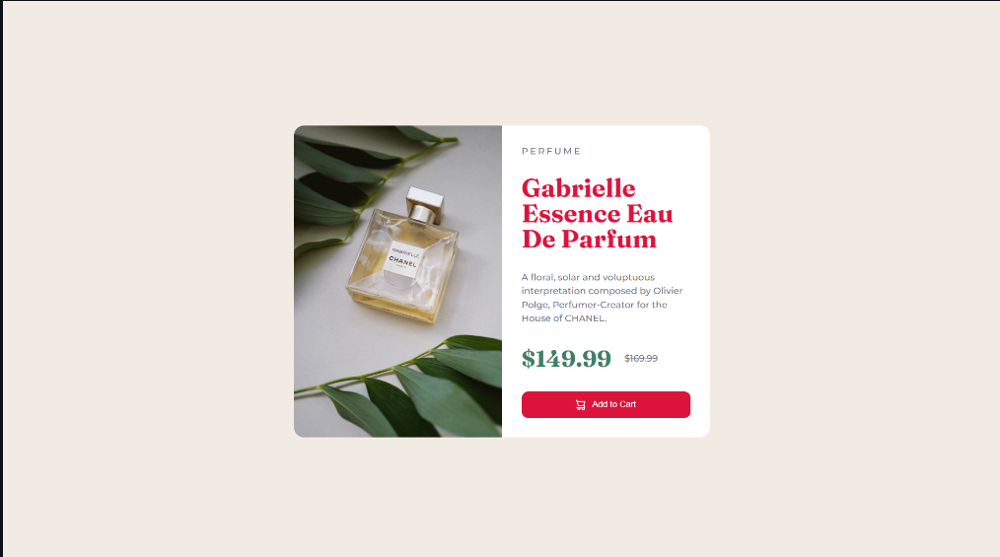

# Question 9
## Main preview

# Tak 1
## Change Title Color

let productTitle = document.querySelector(".caption .title");
productTitle.style.color = "#dc143c";

# Task 2
## Change Button background color after click

let cartBtn = document.querySelector(".caption .add-to-cart");
cartBtn.addEventListener("click", (click) => {
  cartBtn.style.background = "#dc143c";
});

